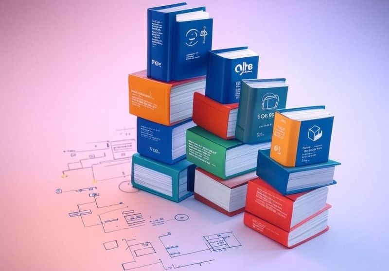

# March 27, 2025

Keep learning, keep evolving, keep moving forward.
That's the only path to success.

Here are my 7 reads for this week:

Elevate your Git game with these 5 advanced techniques. From rebasing to custom hooks, become a more efficient developer.
https://lnkd.in/d7d4fNkF

Dive deep into the Interface Segregation Principle (ISP) with Kotlin for Android. Learn how to apply SOLID principles effectively.
https://lnkd.in/dwX5MGfD

Discover the top 16 DevOps tools for 2025, perfect for Site Reliability Engineers (SREs) too. Automation, monitoring, and more.
https://lnkd.in/d9q37j3z

VS Code introduces Next Edit Suggestions, enhancing your coding experience with AI-powered code completion and suggestions.
https://lnkd.in/dRd-aGSx

Master the art of technical documentation in 2025 with this step-by-step guide. Learn to communicate your tech work effectively.
https://lnkd.in/dwK7h6A9

Explore how Netflix ingeniously built a distributed counter system to handle millions of simultaneous requests. A lesson in scalability.
https://lnkd.in/d-CJ9PCr

From zero to interview-ready, master shell scripting with this comprehensive guide. Essential for any developer's toolkit.
https://lnkd.in/diwY7azd

---

## Media

---

[View original post on LinkedIn](https://www.linkedin.com/feed/update/urn:li:activity:7297528521562710016/)