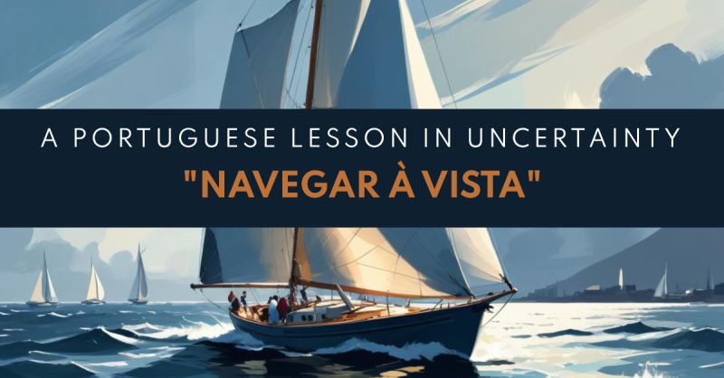

# March 27, 2025

Navegar à Vista: A Portuguese Lesson in Uncertaint

In everyone's professional life, there will be times when the path forward isn't entirely clear. We might have a vision of our destination – that dream project, that growth target, that leadership role – but the currents of the market, the winds of competition, and the fog of unforeseen circumstances can obscure the ideal course.

Here in Portugal, we have a nautical expression that perfectly captures this feeling: "Navegar à vista" It translates to "sailing by sight" and it describes navigating with the coastline always in view. This approach resonates with anyone who has ever felt unsure but determined.

Here are some situations where adopting a "navegar à vista" approach can benefit you:

𝗘𝗺𝗯𝗿𝗮𝗰𝗲 𝗜𝗻𝗰𝗿𝗲𝗺𝗲𝗻𝘁𝗮𝗹 𝗣𝗿𝗼𝗴𝗿𝗲𝘀𝘀: When faced with a complex challenge, break it down into smaller, achievable steps. Celebrate each milestone, even if it seems insignificant in the grand scheme. This keeps you moving forward and prevents feeling overwhelmed.

𝗟𝗲𝗮𝗿𝗻 𝗯𝘆 𝗗𝗼𝗶𝗻𝗴: Don't wait for perfect information before taking action. Sometimes, the best way to learn is through trial and error. Experiment, gather data, and adapt your approach as you go. "Navegar à vista" encourages a flexible and iterative way of working.

𝗙𝗼𝗰𝘂𝘀 𝗼𝗻 𝘁𝗵𝗲 𝗗𝗲𝘀𝘁𝗶𝗻𝗮𝘁𝗶𝗼𝗻: It's easy to get lost in the immediate obstacles. Remember your long-term goals and use them as a guiding star. This unwavering focus on the destination will help you stay motivated during challenging times.

𝗦𝗲𝗲𝗸 𝗚𝘂𝗶𝗱𝗮𝗻𝗰𝗲 𝗪𝗵𝗲𝗻 𝗡𝗲𝗲𝗱𝗲𝗱: Just like a ship captain consults their charts, don't be afraid to seek advice from mentors, colleagues, or industry experts. Their insights can help you navigate tricky situations and course-correct when needed.

"Navegar à vista" is a powerful reminder that uncertainty is inevitable in business. However, by employing a strategic approach, a focus on progress, and a willingness to adapt, we can all navigate our way to success, even when the coast is not always clear.

What are your thoughts this Portuguese expression? Share your experiences with navigating uncertainty in the comments below!

hashtag
#uncertainty 
hashtag
#leadership 
hashtag
#portugal 
hashtag
#professionaldevelopment

**Hashtags:** #uncertainty #professionaldevelopment #leadership #portugal

---

## Media

---

[View original post on LinkedIn](https://www.linkedin.com/feed/update/urn:li:activity:7202319633184468992/)