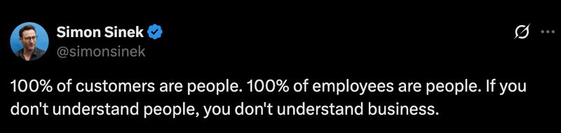

# July 30, 2025

The biggest challenge isn't mastering new frameworks or learning advanced system design (though those matter). It's learning to understand and connect with people.

I've seen brilliant engineers struggle in leadership roles because they keep approaching everything through a technical lens. They optimize code and processes but miss the human dynamics that actually drive team performance.

The most successful engineering leaders I know learned to "debug" people problems with the same curiosity they bring to code issues.

Technical skills get you in the door, but people skills determine how far you go.

As so often he does, Simon Sinek with the 1 phrase that sums it up.

---

## Media

---

[View original post on LinkedIn](https://www.linkedin.com/feed/update/urn:li:activity:7346144240814436355/)