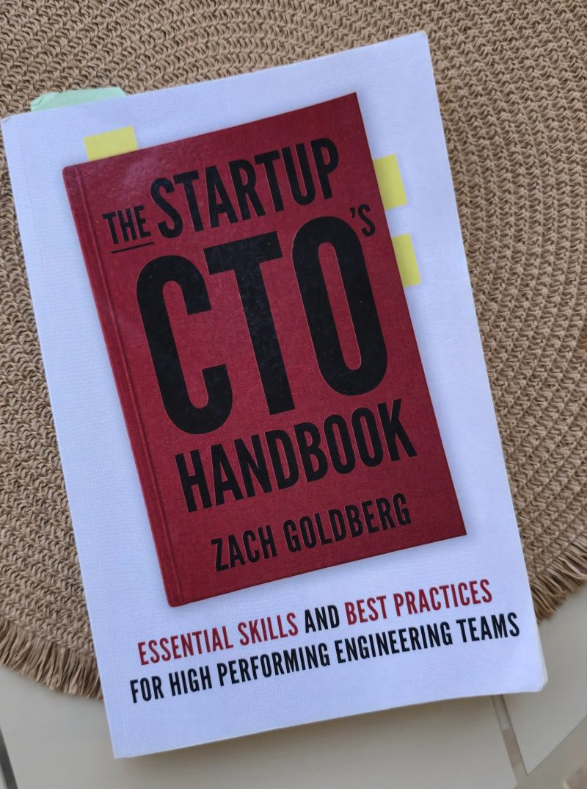

# August 29, 2025

Just finished reading "The Startup CTO's Handbook" by Zach Goldberg and it really brought to light one of the major misconceptions in tech? That being a great engineer automatically makes you a great CTO.

Goldberg breaks down why so many brilliant engineers struggle when they step into executive roles. It's not about getting better at coding or architecture - it's about completely shifting your focus to business strategy, people leadership, and cross-functional collaboration.

The reality is harsh: successful CTOs spend way more time on budgets, hiring strategies, and board communications than they do writing code. They learn to delegate technical decisions and focus on enabling their teams rather than being the primary technical contributor.

This book does a great job explaining that transition and why deliberate leadership development matters more than assuming your technical skills will carry you through.
It's full of practical examples and actionable tips, making it easy to implement changes.

If you're considering a move into tech leadership or already struggling with that balance, I'd recommend giving it a read.

---

## Media

---

[View original post on LinkedIn](https://www.linkedin.com/feed/update/urn:li:activity:7356051394719559680/)