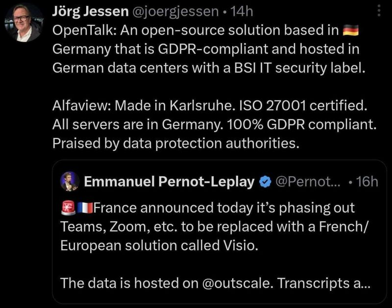

# January 26, 2026

This is not the way.

France announces it's phasing out Teams and Zoom for a European alternative, and the first response? 
"... ISO 27001 certified. .. 100% GDPR compliant. Praised by data protection authorities."

Come on.

I'm all for Europe. I want European companies to win, I work at BRIDGE IN helping companies hire and expand across Europe. I've lead ISO certifications on European companies. 
This matters to me.

But if your instinct is to lead with compliance badges, you've already lost.
Remember COVID? People didn't flock to Zoom because it was secure. It literally had security issues. They used it because it worked. It was easy. It was good.

Features and user experience drive adoption. Not certifications.
When we lead with regulations, we get two outcomes: 
→ Products nobody wants to use 
→ Products people are forced to use

That's not winning. That's mandating mediocrity.

Build something people are excited about. Something that makes them say "wow, this is better." Then yes, make it secure, make it compliant.

But compliance is the baseline, not the pitch.
Stop selling checkboxes. 
Start building products people actually want.

---

## Media

---

[View original post on LinkedIn](https://www.linkedin.com/feed/update/urn:li:activity:7421834734336540674/)