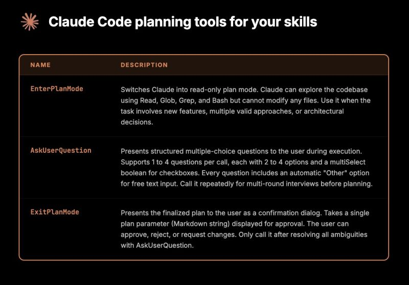

# February 25, 2026

If you're building skills for Claude Code, the planning ones are the highest leverage.

Three tools that should be in every planning skill: 
- EnterPlanMode to go read-only before touching anything
- AskUserQuestion so Claude asks when something's unclear instead of inventing an answer
- ExitPlanMode to give you a reviewable markdown plan before execution starts.

The loop is: plan, review, approve, execute. In that order. Every time.

And if you're not building skills yet:
npx skills add anthropics/skills --skill skill-creator

Run that. Now you have a skill that creates skills. 
Which is either very useful or a little recursive depending on your mood.

---

## Media

---

[View original post on LinkedIn](https://www.linkedin.com/feed/update/urn:li:activity:7429843940163612672/)