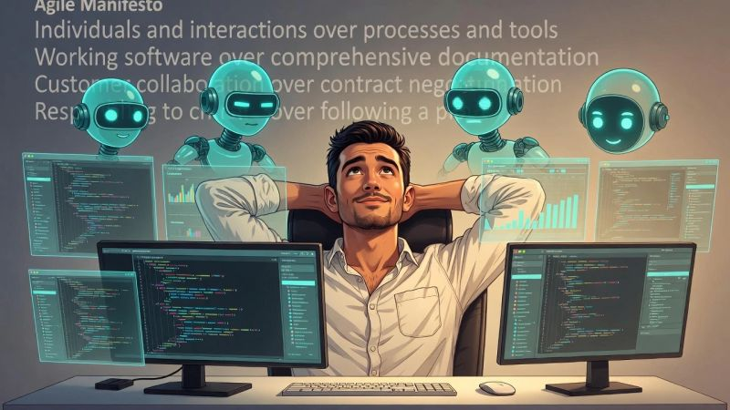

# February 25, 2026

The Agile Manifesto is 24 years old. Yest it's never been more relevant.

As AI agents become coding collaborators, the original principles hit different:

"Deliver working software frequently" → Agents compress the feedback loop from sprints to seconds.

"Welcome changing requirements" → Agents don't have ego. Pivoting mid-task isn't disruption, it's just the next prompt.

"Working software is the primary measure of progress" → Not lines generated. Not impressive architecture. Does it run? Does it solve the problem?

"Simplicity—maximizing the amount of work not done" → Agents can over-engineer. Our job is now asking: what's the simplest thing that works?

"Continuous attention to technical excellence" → Agents write probable code, not excellent code. Technical excellence still requires human stewardship.

The principle I keep coming back to: "Build projects around motivated individuals. Trust them to get the job done."

Agents are tools, not individuals. But the humans wielding them still need trust and autonomy.

What's shifted is what we trust people to do less typing, more thinking. Less implementation, more judgment.

The Manifesto was about values. Values don't expire.

---

## Media

---

[View original post on LinkedIn](https://www.linkedin.com/feed/update/urn:li:activity:7422190465476698112/)