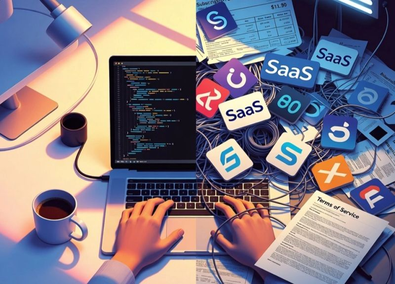

# February 25, 2026

The build vs. buy equation just flipped.
(if you are a domain expert)

In the age of AI, for a well trained team using the most recent tools, spinning up a custom solution takes days, not months, if you know what you are building. 

So why are we still defaulting to third-party tools for software development and running our systems?

Even "free" comes with hidden costs:
→ Learning curves that slow down your team
→ Vendor lock-in that limits your options
→ Update cycles you don't control
→ Feature bloat you'll never use
→ Compliance headaches (where's your data actually going?)
→ Rate limits and credit systems that hit at the worst times

When you build it yourself:
→ You fix bugs on YOUR timeline
→ You add exactly the features your team needs
→ You keep it lean
→ Your data stays in your infrastructure
→ You own the roadmap

I'm not saying go vibe-code your own Sentry, Datadog. 
If you can afford enterprise tooling and have genuine scale needs, use it.

But for early-stage teams? Small companies? Scrappy startups?

The calculus has changed.

hashtag
#SoftwareEngineering 
hashtag
#Startups 
hashtag
#BuildVsBuy 
hashtag
#TechLeadership

**Hashtags:** #SoftwareEngineering #Startups #TechLeadership #BuildVsBuy

---

## Media

---

[View original post on LinkedIn](https://www.linkedin.com/feed/update/urn:li:activity:7424010875159715840/)