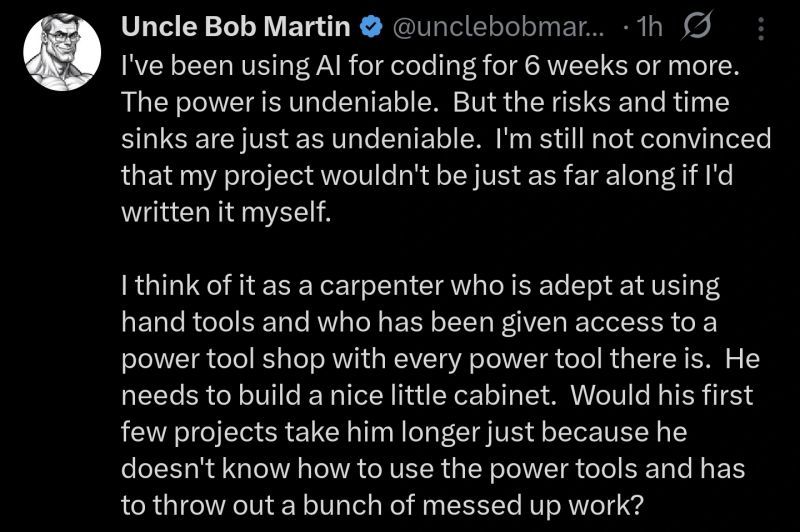

# February 25, 2026

The Clean Code guy tried AI coding for 6 weeks.

His take: powerful, yes. But also a time sink. And he's not even sure his project would be behind if he'd just done it himself.

This is refreshing. Not "AI is useless" doomerism.
Not "I built a SaaS empire in 3 hours" LinkedIn fantasy. 

Just a guy with 50 years of experience going "huh, this is tricky."

That's where most of us actually are. We just don't have the follower count to say it without getting ratio'd.

---

## Media

---

[View original post on LinkedIn](https://www.linkedin.com/feed/update/urn:li:activity:7424810702164623361/)