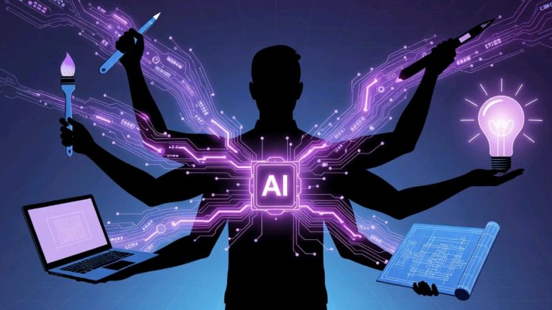

# February 25, 2026

The panic around AI replacing software jobs? Totally off base.

Don't agree? Just listen to Marc Andreessen on Lenny Rachitsky podcast and it might change your mind.

What's actually happening is more interesting: we're in a "Mexican standoff" between PMs, designers, and engineers. Everyone's capabilities are expanding simultaneously. No one's getting replaced—everyone's getting supercharged.

Marc's take on career strategy hits different: develop an "E-shaped" career. Combine multiple skills. Be the engineer who can design. The PM who can code. The designer who understands systems.

AI becomes a force multiplier for each skill you have.

The people who'll thrive aren't the ones mastering one thing in isolation. They're the ones stacking skills and using AI to amplify all of them at once.

Still worth learning to code? Absolutely. But now it's about combining that with product sense, design thinking, communication.

The real AI boom hasn't even started. And when it does, the biggest winners will be the ones who refused to stay in a single lane.

hashtag
#AI 
hashtag
#SoftwareEngineering 
hashtag
#CareerGrowth 
hashtag
#FutureOfWork 
hashtag
#ProductManagement

**Hashtags:** #ProductManagement #CareerGrowth #FutureOfWork #SoftwareEngineering #AI

---

## Media

---

[View original post on LinkedIn](https://www.linkedin.com/feed/update/urn:li:activity:7423323130636713984/)