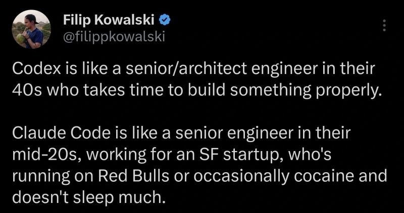

# February 25, 2026

The tale of the 2 AIs.

Codex: methodical, careful, takes its time, probably has opinions about design patterns.

Claude Code: cranked out three features while you were making coffee, two of them work, one of them invented a new database schema.

The architect vs the cracked junior dev who somehow keeps getting stuff done despite everything suggesting they shouldn't.

Here's the thing though. Speed matters. A lot. You can always slow down a fast dev. You can't speed up a slow one.

Claude Code lets me iterate in minutes instead of hours. Throw out bad ideas cheap. Try stuff I wouldn't bother with if I had to write it myself. That's not chaos, that's leverage.

And the "running on Red Bulls" energy? That's fine. I'm still the one reviewing the PR. Still the one deciding what gets merged. The fast junior ships, but the senior approves.

Just keep your hand on the wheel.

hashtag
#AI 
hashtag
#Claude 
hashtag
#Codex 
hashtag
#SoftwareDevelopment

**Hashtags:** #Codex #Claude #SoftwareDevelopment #AI

---

## Media

---

[View original post on LinkedIn](https://www.linkedin.com/feed/update/urn:li:activity:7427253864413966336/)