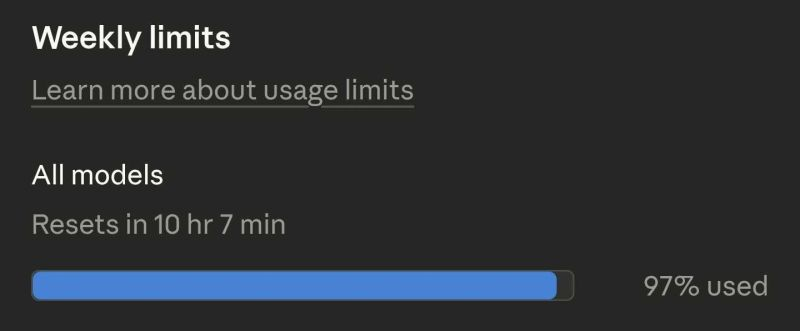

# March 06, 2026

Almost hit the weekly limit on Claude this week, even on a premium plan.

Took a screenshot because it felt like a milestone, not a problem.

If you're starting a new project with AI and being careful about how much you use it, you're probably not learning much. The only way to understand what it can actually do is to push it until something breaks.

Most of the time what breaks first is your assumptions about what it can't do.

---

## Media

---

[View original post on LinkedIn](https://www.linkedin.com/feed/update/urn:li:activity:7435432013613969408/)