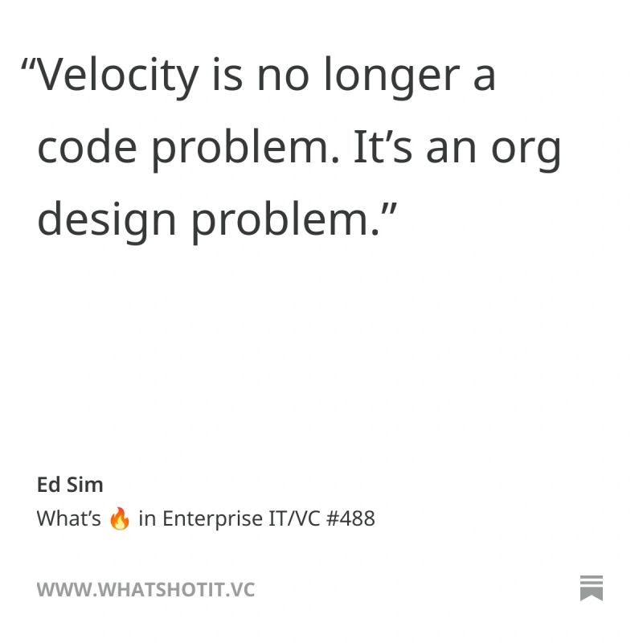

# March 13, 2026

The org isn't slow because of bad processes.
It's slow because of people who built their confidence around a pace that no longer exists.

That's the harder problem. You can redesign the org chart. You can't redesign someone's sense of identity overnight. 

The manager who thrives on being the person who "knows the product cold" now has to accept they'll always be slightly behind. The lead who built trust through careful, deliberate delivery now has to trust output they didn't fully read.

The teams that actually keep up with agentic engineering velocity won't be the ones who ran a workshop on AI tools. 
They'll be the ones who created enough psychological safety for people to say "I don't know how to work at this speed yet" without it feeling like a performance review.

The bottleneck moved from engineering to everywhere else.

Moving it back means helping people change how they see themselves at work. Not their skills. Their identity.
That takes longer than any process redesign.

---

## Media

---

[View original post on LinkedIn](https://www.linkedin.com/feed/update/urn:li:activity:7436185576791363585/)