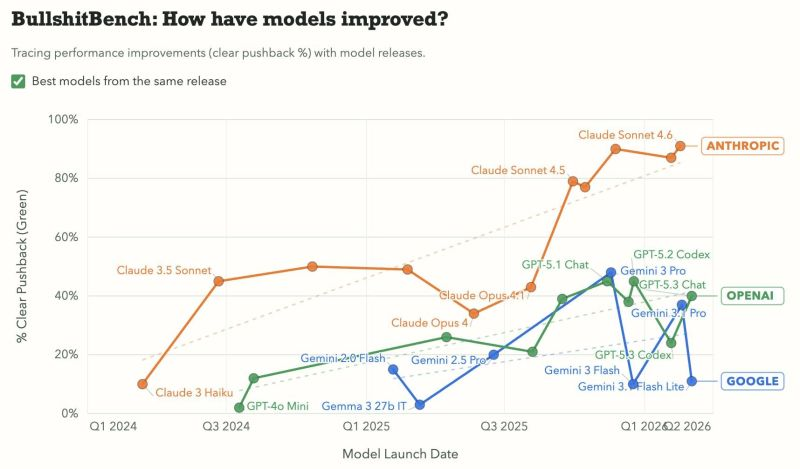

# March 20, 2026

There's an AI benchmark called BullshitBench by Peter Gostev 
It feeds models false premises disguised in jargon and measures how often they push back.

Claude Sonnet 4.6: ~90% pushback.
The rest: roughly a coin flip.

So statistically, there's a 50% chance your AI copilot is just a very fast yes-man with a good vocabulary.
This isn't an accident. These models are trained on human preference, and humans, broadly, do not prefer to be told they're wrong. Chatbot Arena rewards pleasant interactions. So that's what gets built. A model optimized to make you feel smart is just doing its job.

The problem is you're trying to do yours.

If half the time your tool is agreeing with a bad assumption instead of flagging it, you're not getting leverage. You're getting expensive confirmation bias at inference speed.

Claude seems to have optimized for a different user. One who'd rather be corrected than confidently wrong.

hashtag
#AI

**Hashtags:** #AI

---

## Media

---

[View original post on LinkedIn](https://www.linkedin.com/feed/update/urn:li:activity:7439956120992964608/)