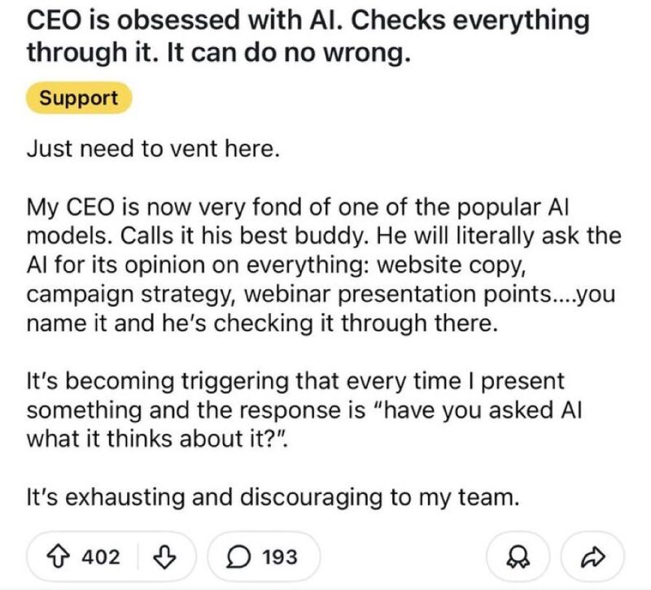

# March 26, 2026

Everyone's dunking on this CEO.
I get it. "Have you asked AI?" is a strange thing to hear after presenting your work. It signals distrust. It undercuts expertise. It's annoying.

It's also possibly a CEO who's been getting slow, polished, non-answers for months and found something that just... responds. Directly. Without scheduling a follow-up.
The team feels discouraged. I believe that. The CEO is reaching for a faster feedback loop. I believe that too. Both things are probably true. The frustration just runs in opposite directions.

What I keep thinking about is the implicit comparison. This CEO, who is annoying to work for right now, versus the leadership team forming an AI Innovation Committee and wrapping up month five of their limited Copilot trial. One is creating friction. The other is burning time while calling it strategy.

I know which company I'd rather be building something inside, and in some ways I already am at BRIDGE IN .

The teams that will struggle aren't the ones with an AI-obsessed CEO. They're the ones where nobody in the room has a faster answer than the deck they prepared last Tuesday.

The CEO found a shorter feedback loop before the team did.
That's the actual problem. And it's fixable.

---

## Media

---

[View original post on LinkedIn](https://www.linkedin.com/feed/update/urn:li:activity:7442945372102017026/)