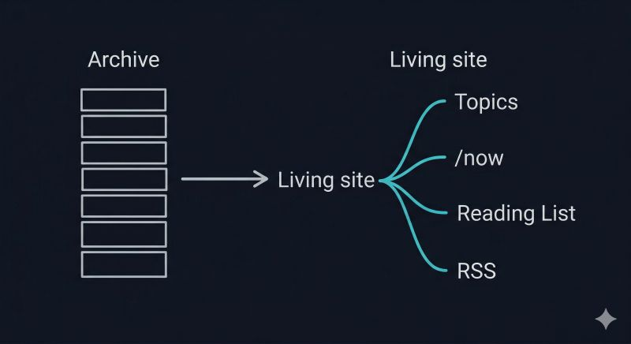

# April 01, 2026

Derek Sivers has this idea called a /now page. Not who you are. What you're doing right now. What you'd tell a friend you hadn't seen in a year.

I added one to my site last week and it shifted how I think about the whole thing.

The archive I shared a few days ago was the starting point. 230+ LinkedIn posts, converted to markdown, published as a static site I control. Useful. But static. A snapshot.
The /now page made it alive. What I'm building, what I'm reading, what I'm thinking about. Updated when something changes. It turned a backup into something closer to a working notebook.

That same impulse carried into the rest. I added topic pages that pull posts by theme. AI in Engineering. Leadership. Building Software. And a Reading List that surfaced something I hadn't noticed: seven years of book mentions scattered across posts, suddenly browsable in one place. An accidental reading log.

The pattern is the same one Sivers identified. Most personal sites answer "who is this person?" The better question is "what is this person doing?" Once you start organizing around that, everything else follows.

hashtag
#ContentOwnership 
hashtag
#NowPage 
hashtag
#PersonalWebsite

**Hashtags:** #NowPage #PersonalWebsite #ContentOwnership

---

## Media

---

[View original post on LinkedIn](https://www.linkedin.com/feed/update/urn:li:activity:7445010820125622273/)