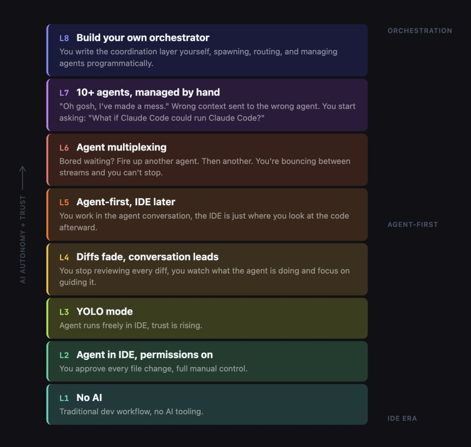

# April 06, 2026

This chart has been going around and it's the most accurate map of AI adoption I've seen.
Not because of the levels themselves. Because of the gaps between them.

Most people I talk to are somewhere between L2 and L3. Agent in the IDE, permissions on, maybe YOLO mode on a good day. They're evaluating tools. Reading benchmarks. Running pilots.

At BRIDGE IN we're at L7. Ten-plus agents running across different workflows, context flying between them, and yes, sometimes the wrong context hits the wrong agent. It's messy. But it mostly works.
The distance between L3 and L7 isn't skill or budget (altought it does matter), it's reps. We got here because we started earlier and used it every day on real work. 
Not pilots. Not sandboxes. Production.

That's the thing about AI adoption. It compounds. Every mistake teaches you something about how to structure prompts, when to trust output, where human review actually matters. You can't shortcut that with a workshop.

The bottleneck was never the tool.

hashtag
#AI 
hashtag
#AgenticDevelopment 
hashtag
#Engineering 
hashtag
#Leadership

**Hashtags:** #Leadership #AgenticDevelopment #Engineering #AI

---

## Media

---

[View original post on LinkedIn](https://www.linkedin.com/feed/update/urn:li:activity:7446825285041385472/)