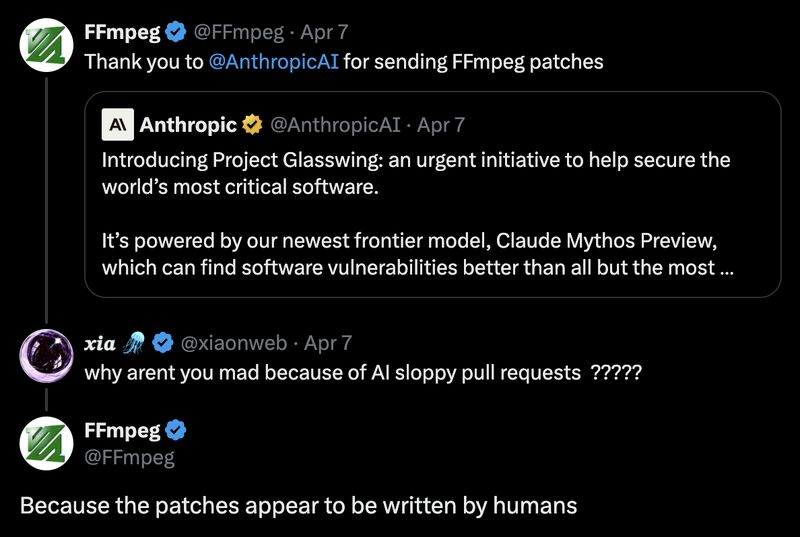

# April 11, 2026

The most anti-AI-slop project in open source just publicly thanked an AI company for code contributions.

FFmpeg has mass-rejected AI-generated pull requests for months. They've been vocal about it. They became the poster child for "keep your AI code out of our repo."

Then Anthropic sent patches through Project Glasswing, and FFmpeg's response was: "The patches appear to be written by humans."

Someone asked the obvious question. Why aren't you mad? And FFmpeg's answer tells you everything about where the real line is.

The resistance was never about where the code came from. It was about whether the person submitting it actually cared about the codebase. Most AI-generated PRs fail that test because most people treat the model like a slot machine. Prompt, submit, move on. No context, no review, no understanding of the project's conventions.

What Anthropic did differently wasn't magic. They pointed a capable model at a specific, well-scoped problem (security vulnerabilities) and made sure the output met the project's standards. That's just good engineering with a different tool.

The filter was always craftsmanship, not origin.

hashtag
#AI 
hashtag
#OpenSource 
hashtag
#SoftwareEngineering

**Hashtags:** #AI #OpenSource #SoftwareEngineering

---

## Media

---

[View original post on LinkedIn](https://www.linkedin.com/feed/update/urn:li:activity:7448734606801055745/)