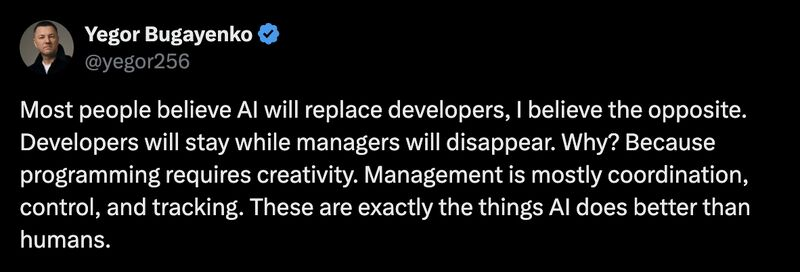

# April 13, 2026

This take from Yegor Bugayenko is directionally right but the reasoning is backwards.

Programming requires creativity, sure. But it also requires a ton of coordination. Dependencies, code reviews, integration, deployment pipelines, syncing with three other teams on a shared API. Developers spend more time coordinating than most of them would admit.

And management isn't mostly coordination. That's project management. The actual work of management is navigating ambiguity, building trust in teams where it doesn't come naturally, and making bets with incomplete information.

What AI automates is the coordination layer inside every role. Status updates, tracking, scheduling, synthesizing information across systems. That chunk of your job, whatever your title, is shrinking fast.

The managers who were already doing the hard human work are fine. The ones who built their identity around knowing the status of everything... they were already redundant. AI just made it visible.

Same for developers who only ever glued APIs together.

The question isn't which role disappears. It's which version of each role had anything underneath the coordination.

hashtag
#AI 
hashtag
#Leadership 
hashtag
#Development

**Hashtags:** #Development #Leadership #AI

---

## Media

---

[View original post on LinkedIn](https://www.linkedin.com/feed/update/urn:li:activity:7449472720330854400/)