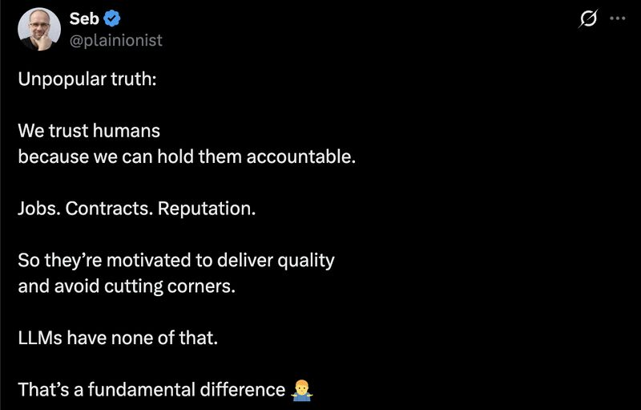

# April 15, 2026

This take has a hidden assumption: that trust = motivated-to-do-well.

We trust calculators. They have no reputation. No quarterly review. No mortgage. They're not motivated to deliver quality because they're not motivated to deliver anything.

We trust them because somebody tested them.

Compilers, databases, test runners, half the stack a developer uses daily. None of them have skin in the game. All of them earned trust through specification and verification, not loyalty.

Seb's framing works for employees. It doesn't describe how we trust anything else we rely on.

LLMs aren't failing the "motivated human" trust test. They're being graded on the wrong rubric. The real question is different. What have I tested this on? Where does it fall off? What does it look like when it fails?

That's a different exercise. Eval sets. Red-teaming. Spot checks. The humility to admit where the tool breaks down.

The accountability model assumes we already know how the human thinks and just need them to try. The verification model assumes we don't, and builds the checks anyway.

One of those scales to LLMs. One of those doesn't.

ps: the verification model works better on humans too. Motivation is a nice-to-have. Tests are load-bearing.

hashtag
#AI 
hashtag
#SoftwareEngineering 
hashtag
#EngineeringLeadership

**Hashtags:** #SoftwareEngineering #EngineeringLeadership #AI

---

## Media

---

[View original post on LinkedIn](https://www.linkedin.com/feed/update/urn:li:activity:7450184427395014656/)