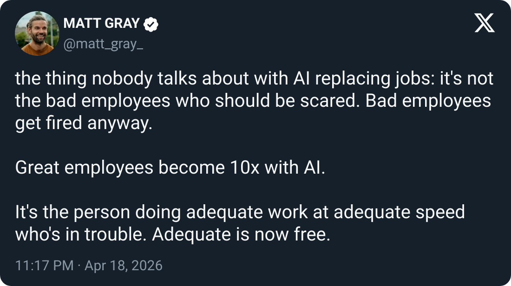

Matt's right, and the historical echo is louder than it reads.

Same thing played out in the 80s and 90s with computers. The adequate worker who kept doing the job the old way wasn't fired in year one. Or year three. They got absorbed, moved sideways, buffered by colleagues picking up the slack. Then one day the buffer ran out.

That transition took twenty years. This one is compressing into two.

You can't wait for your company to train you into it. The people who came out ahead last time weren't the most talented. They were the ones experimenting on their own time, on their own problems, before it became a mandate. Back then the window was years. Now it's quarters.

Adequate is a stable position when the ground isn't moving. The ground is moving, and it's moving fast.

ps: the skill isn't "using AI." It's being the kind of person who rebuilds how they work when the tools change. You used to have a decade to do it. Now you have a year.

**Hashtags:** #AI #FutureOfWork #CareerGrowth

---

## Media

---