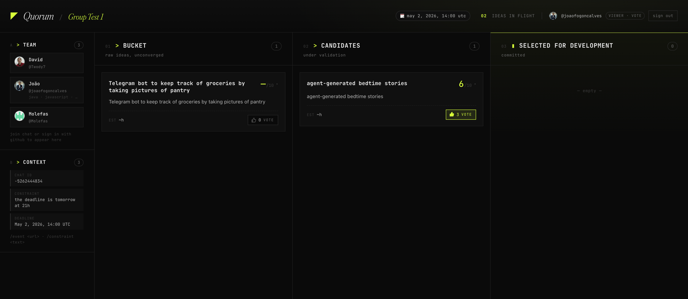

AI made software cheap to ship. The hard part is now figuring out what to ship.

That gap is also the reason we walked into Agents Day with no team, no plan, no idea what we were building.

We spent the first hour on the question. Picked Cloudflare's challenge as the constraint, gave an agent access to our GitHub accounts, and from our skills it produced a plan with roles and tasks. By hour two we were building.

We called it Quorum. A chat-native agent that lives in your team's group chat and walks ideas through ideation, validation, and planning, with backflow when constraints shift. The pitch: AI made software cheap, picking what to build is the new bottleneck, and getting it wrong now costs more than ever because everything else got faster.

Built end-to-end on Cloudflare. Deployed and user-tested by the end of the day.

Two things made the speed possible.

Most of the typing was the agents. None of us could have shipped this solo in a day. Three of us with agents in the room shipped it before dinner.

The less obvious part was the coordination. Three people building in parallel usually collide somewhere. We didn't, because the agents knew what each other were building. We never had to pass implementation details around the table. The plan was shared context, and the agents read it before the humans did.

That's the part I keep thinking about. The layer AI doesn't cover yet is the what. We built that. AI then collapsed the how into half a day. And the coordination layer, the thing teams usually spend most of their time on, mostly disappeared because the agents had a shared head.

Same room. Three people. The bottleneck moved twice in one day.

ps: shoutout to [Pedro Gustavo Torres](https://www.linkedin.com/in/pedrogustavotorres/) and [Pedro Oliveira](https://www.linkedin.com/in/pcboliveira/) for putting Agents Day together, and to [David Gonçalves](https://www.linkedin.com/in/davidsgoncalves/) and [Rui Molefas](https://www.linkedin.com/in/rui-molefas/) for the collab.

Thanks to [Talent Protocol](https://www.talentprotocol.com/), [CTO Portugal](https://www.ctos.pt/), and [Cloudflare](https://www.cloudflare.com/) for the day.

**Hashtags:** #AgenticAI #AIEngineering #AgentsDay

---

## Media

