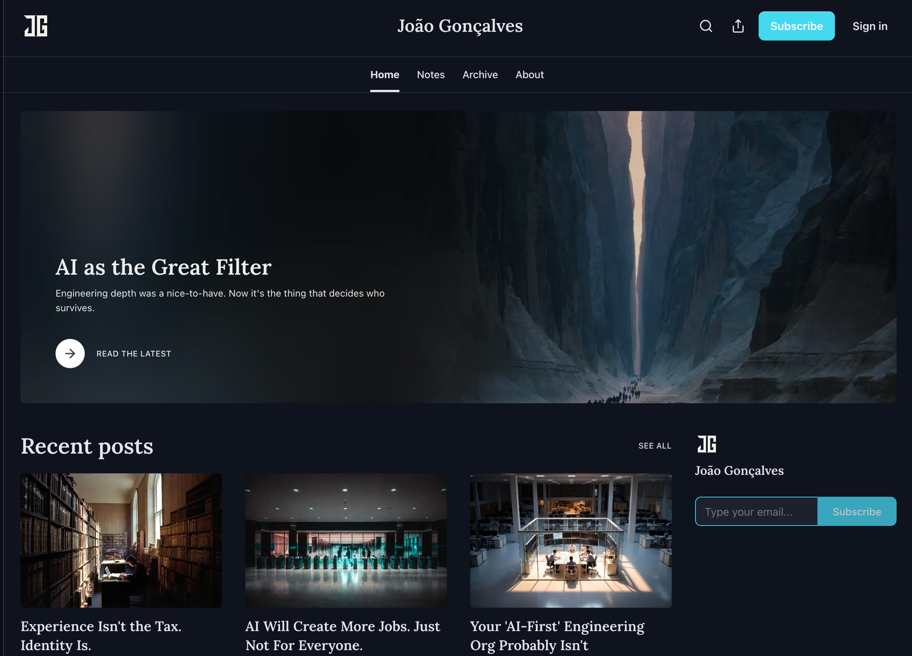

Quietly mirrored every essay I've written to Substack over the last few months. The site is still the canonical home. That's where the work lives and where it gets indexed. Substack is the email rail for the people who want the writing to show up instead of having to remember a URL.

Nine pieces up so far. All about what AI is actually doing to engineering work, written from inside the shift.

If email is the surface you prefer: [joaofogoncalves.substack.com](https://joaofogoncalves.substack.com/)

**Hashtags:** #Writing #Substack #AI

---

## Media

